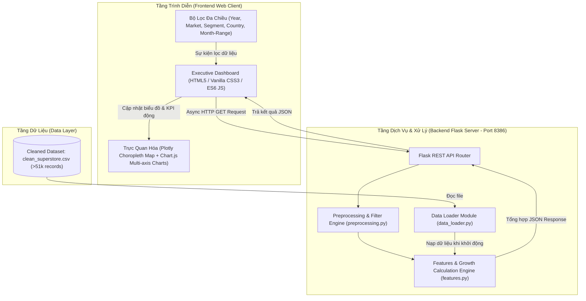

# 🌐 Global Superstore Sales & Logistics Analytics Dashboard
> **MindX Technology School | Final Capstone Project**  
> Hệ thống phân tích dữ liệu kinh doanh & vận chuyển chuỗi bán lẻ toàn cầu kết hợp Executive Dashboard trực quan hóa tương tác thời gian thực.

---

[](https://www.python.org/)
[](https://palletsprojects.com/p/flask/)
[](https://pandas.pydata.org/)
[](https://www.chartjs.org/)
[](https://plotly.com/javascript/)
[](https://opensource.org/licenses/MIT)

---

## 📑 Mục Lục (Table of Contents)

1. [Giới Thiệu Dự Án (Project Overview)](#-1-giới-thiệu-dự-án-project-overview)
2. [Dữ Liệu & Quy Trình Tiền Xử Lý (Data Pipeline)](#-2-dữ-liệu--quy-trình-tiền-xử-lý-data-pipeline)
3. [Kiến Trúc Hệ Thống (System Architecture)](#-3-kiến-trúc-hệ-thống-system-architecture)
4. [Đặc Tả Chi Tiết 6 REST API Endpoints](#-4-đặc-tả-chi-tiết-6-rest-api-endpoints)
5. [Tính Năng Giao Diện Web Client (Dashboard Features)](#-5-tính-năng-giao-diện-web-client-dashboard-features)
6. [Công Nghệ Sử Dụng (Tech Stack)](#-6-công-nghệ-sử-dụng-tech-stack)
7. [Hướng Dẫn Cài Đặt & Khởi Chạy (Installation & Getting Started)](#-7-hướng-dẫn-cài-đặt--khởi-chạy-installation--getting-started)
8. [Tác Giả & Lời Cảm Ơn (Authors & Acknowledgments)](#-8-tác-giả--lời-cảm-ơn-authors--acknowledgments)

---

## 📖 1. Giới Thiệu Dự Án (Project Overview)

Trong bối cảnh thương mại bán lẻ và chuỗi cung ứng toàn cầu phát triển mạnh mẽ, việc theo dõi doanh số, quản trị biên lợi nhuận và tối ưu hóa chi phí logistics là bài toán sống còn đối với các nhà quản trị điều hành.

**Dự án Global Superstore Sales & Logistics Analytics Dashboard** là một giải pháp Business Intelligence (BI) hoàn chỉnh theo mô hình Client - Server khép kín:
- **Xử lý dữ liệu lớn (Big Data Processing)**: Khai thác tập dữ liệu bán hàng toàn cầu với hơn **51.290 bản ghi giao dịch** xuyên suốt 4 năm (2011 - 2014) tại hơn 140 quốc gia.
- **Backend API tốc độ cao**: Xây dựng hệ thống REST API bằng Python Flask, tận dụng sức mạnh xử lý mảng của Pandas để tổng hợp dữ liệu thời gian thực.
- **Executive Frontend Dashboard**: Thiết kế giao diện điều hành chuẩn quốc tế với trải nghiệm người dùng hiện đại: hỗ trợ Dark/Light Theme, hiệu ứng Glassmorphism, bộ lọc toàn cục đa chiều, bản đồ nhiệt tương tác (Choropleth World Map) và biểu đồ xu hướng tăng trưởng phân tích chuyên sâu (% MoM, % YoY).

---

## 📊 2. Dữ Liệu & Quy Trình Tiền Xử Lý (Data Pipeline)

### 2.1. Nguồn Dữ Liệu
- **Tên tập dữ liệu**: [Global Superstore Dataset trên Kaggle](https://www.kaggle.com/datasets/fatihilhan/global-superstore-dataset).
- **Quy mô**: **51.290 dòng** giao dịch, chứa dữ liệu thương mại quốc tế từ năm 2011 đến năm 2014.

### 2.2. Quy Hoạch 14 Thuộc Tính Dữ Liệu Trọng Tâm
Từ 24 cột dữ liệu ban đầu, dự án đã tinh lọc còn **14 trường thuộc tính chuẩn hóa** để tối ưu hóa bộ nhớ và tốc độ tính toán:

| STT | Tên cột (Column Name) | Kiểu dữ liệu | Ý nghĩa nghiệp vụ |
| :---: | :--- | :---: | :--- |
| **1** | `Order Date` | `Datetime / String` | Ngày đặt hàng (định dạng `YYYY-MM-DD`, trích xuất `Order Month`) |
| **2** | `Ship Mode` | `String` | Hình thức giao hàng: Standard Class, Second Class, First Class, Same Day |
| **3** | `Segment` | `String` | Phân khúc khách hàng: Consumer, Corporate, Home Office |
| **4** | `Country` | `String` | Quốc gia giao hàng (phục vụ Choropleth Map & phân tích theo nước) |
| **5** | `Market` | `String` | Thị trường địa lý lớn: APAC, EU, US, LATAM, EMEA, Africa, Canada |
| **6** | `Category` | `String` | Ngành hàng lớn: Technology, Furniture, Office Supplies |
| **7** | `Sub-Category` | `String` | Nhóm sản phẩm chi tiết (17 nhóm: Phones, Chairs, Storage, Binders,...) |
| **8** | `Product Name` | `String` | Tên cụ thể của sản phẩm (phục vụ Top Products Ranking) |
| **9** | `Quantity` | `Integer` | Số lượng sản phẩm xuất bán |
| **10**| `Sales` | `Float` | Doanh thu bán hàng ($) |
| **11**| `Discount` | `Float` | Tỷ lệ giảm giá / chiết khấu (0.0 đến 0.85) |
| **12**| `Profit` | `Float` | Lợi nhuận ròng thu về ($) |
| **13**| `Shipping Cost` | `Float` | Chi phí vận chuyển đơn hàng ($) |
| **14**| `Year` | `Integer` | Năm giao dịch (2011, 2012, 2013, 2014) |

### 2.3. Quy Trình Tiền Xử Lý (Data Cleaning Pipeline)
1. **Làm sạch giá trị khuyết thiếu**: Loại bỏ các thuộc tính không cần thiết có tỷ lệ null cao (như `Postal Code`), xử lý các dòng dữ liệu không hợp lệ.
2. **Chuẩn hóa kiểu dữ liệu**: Ép kiểu số thực làm tròn 2 chữ số thập phân (`Sales`, `Profit`, `Shipping Cost`), ép kiểu số nguyên (`Quantity`, `Year`).
3. **Trích xuất thuộc tính chuỗi thời gian**: Tạo trường `Order Month` dạng `YYYY-MM` để phục vụ tính toán tốc độ tăng trưởng liên tháng (MoM).
4. **Lưu trữ dữ liệu sạch**: File sạch lưu trữ tại `data/processed/clean_superstore.csv`, được nạp trực tiếp vào RAM khi khởi động ứng dụng.

---

## 🏗️ 3. Kiến Trúc Hệ Thống (System Architecture)

Dự án tuân thủ kiến trúc phân tầng chuẩn **RESTful Client - Server**:



---

## 🔌 4. Đặc Tả Chi Tiết 6 REST API Endpoints

Hệ thống cung cấp **6 RESTful API endpoints** với tiền tố `/api/v1/`:

### 📌 Tổng hợp danh mục API

| STT | Endpoint | Method | Tham số truy vấn (Query Parameters) | Chức năng chính |
| :---: | :--- | :---: | :--- | :--- |
| **1** | `/api/v1/sales-by-country` | `GET` | `year`, `region`, `segment` | Thống kê 4 KPI toàn cục & dữ liệu bản đồ nhiệt thế giới |
| **2** | `/api/v1/top-products-by-country` | `GET` | `country`, `top_n`, `year`, `segment` | Lấy danh sách Top sản phẩm bán chạy nhất theo quốc gia |
| **3** | `/api/v1/orders-by-category` | `GET` | `year`, `region`, `segment` | Cơ cấu doanh thu, lợi nhuận và số đơn theo ngành hàng |
| **4** | `/api/v1/shipping-analysis` | `GET` | `year`, `region`, `segment` | Phân tích chi phí vận chuyển theo từng phương thức giao |
| **5** | `/api/v1/yearly-sales-by-country` | `GET` | `period`, `start_month`, `end_month`, `countries`, `metric`, `segment` | Chuỗi thời gian so sánh tăng trưởng doanh thu giữa các nước |
| **6** | `/api/v1/monthly-growth-by-category` | `GET` | `category`, `sub_category`, `metric`, `start_month`, `end_month`, `region`, `segment` | Phân tích doanh số theo tháng & tốc độ tăng trưởng liên tháng (% MoM) |

---

### 🔍 Chi tiết từng Endpoint

#### 1. `GET /api/v1/sales-by-country`
- **Mục đích**: Cung cấp dữ liệu vẽ **Choropleth Map** và 4 thẻ **KPI Tổng quan**.
- **Request mẫu**:
  ```http
  GET /api/v1/sales-by-country?year=2014&region=APAC HTTP/1.1
  Host: localhost:8386
  ```
- **Response mẫu**:
  ```json
  {
    "summary": {
      "total_sales": 3450200.5,
      "total_profit": 425100.2,
      "total_shipping": 368400.0,
      "total_orders": 14200
    },
    "country_data": [
      { "country": "Australia", "sales": 925235.0, "profit": 103900.0, "order_count": 2837 },
      { "country": "China", "sales": 700562.0, "profit": 150683.0, "order_count": 1880 }
    ]
  }
  ```

#### 2. `GET /api/v1/top-products-by-country`
- **Mục đích**: Lấy Top $N$ mặt hàng có doanh thu cao nhất của một quốc gia.
- **Request mẫu**:
  ```http
  GET /api/v1/top-products-by-country?country=United%20States&top_n=5 HTTP/1.1
  Host: localhost:8386
  ```
- **Response mẫu**:
  ```json
  {
    "country": "United States",
    "top_n": 5,
    "top_products": [
      { "product_name": "Canon imageCLASS 2200 Advanced Copier", "category": "Technology", "sales": 61599.82, "quantity": 20, "profit": 25199.93 },
      { "product_name": "Fellowes PB500 Electric Punch Plastic Comb Binding Machine", "category": "Office Supplies", "sales": 27453.38, "quantity": 31, "profit": 7753.04 }
    ]
  }
  ```

#### 3. `GET /api/v1/orders-by-category`
- **Mục đích**: Vẽ biểu đồ Doughnut / Bar phân tích cơ cấu bán hàng theo ngành hàng.
- **Request mẫu**:
  ```http
  GET /api/v1/orders-by-category?year=all HTTP/1.1
  Host: localhost:8386
  ```
- **Response mẫu**:
  ```json
  [
    { "category": "Technology", "sales": 4744557.5, "order_count": 10141, "profit": 663778.73 },
    { "category": "Furniture", "sales": 4110874.19, "order_count": 9876, "profit": 285204.72 },
    { "category": "Office Supplies", "sales": 3787070.23, "order_count": 31273, "profit": 518473.83 }
  ]
  ```

#### 4. `GET /api/v1/shipping-analysis`
- **Mục đích**: So sánh hiệu quả logistics giữa 4 phương thức vận chuyển.
- **Request mẫu**:
  ```http
  GET /api/v1/shipping-analysis HTTP/1.1
  Host: localhost:8386
  ```
- **Response mẫu**:
  ```json
  [
    { "ship_mode": "Standard Class", "total_sales": 7578889.0, "total_shipping_cost": 614627.66, "avg_shipping_cost": 19.97, "order_count": 30775 },
    { "ship_mode": "Second Class", "total_sales": 2565747.0, "total_shipping_cost": 314111.79, "avg_shipping_cost": 30.47, "order_count": 10309 },
    { "ship_mode": "First Class", "total_sales": 1831067.0, "total_shipping_cost": 308102.54, "avg_shipping_cost": 41.05, "order_count": 7505 },
    { "ship_mode": "Same Day", "total_sales": 667202.0, "total_shipping_cost": 115973.72, "avg_shipping_cost": 42.94, "order_count": 2701 }
  ]
  ```

#### 5. `GET /api/v1/yearly-sales-by-country`
- **Mục đích**: Cung cấp dữ liệu chuỗi thời gian so sánh đa quốc gia (Multi-line Chart).
- **Request mẫu**:
  ```http
  GET /api/v1/yearly-sales-by-country?countries=United%20States,Australia,China&metric=sales&period=year HTTP/1.1
  Host: localhost:8386
  ```
- **Response mẫu**:
  ```json
  {
    "period_type": "year",
    "periods": ["2011", "2012", "2013", "2014"],
    "metric": "sales",
    "countries_data": [
      {
        "country": "United States",
        "values": [484247.5, 470532.5, 608473.9, 733947.0],
        "total": 2297200.9,
        "growth_percent": 51.56
      },
      {
        "country": "Australia",
        "values": [168340.2, 200420.5, 260510.3, 295964.0],
        "total": 925235.0,
        "growth_percent": 75.81
      }
    ]
  }
  ```

#### 6. `GET /api/v1/monthly-growth-by-category`
- **Mục đích**: Cung cấp dữ liệu chuỗi thời gian theo tháng và tốc độ tăng trưởng liên tháng (% MoM) cho Category và Sub-Category.
- **Request mẫu**:
  ```http
  GET /api/v1/monthly-growth-by-category?category=Technology&metric=sales&start_month=2012-01&end_month=2014-12 HTTP/1.1
  Host: localhost:8386
  ```
- **Response mẫu**:
  ```json
  {
    "months": ["2012-01", "2012-02", "2012-03"],
    "metric": "sales",
    "total_trend": {
      "values": [42100.5, 38900.2, 51200.0],
      "growth_rates": [null, -7.6, 31.62],
      "total": 132200.7,
      "overall_growth": 21.61
    },
    "summary_kpis": {
      "latest_month": "2014-12",
      "peak_month": "2014-11",
      "overall_growth": 84.5,
      "fastest_subcategory": { "name": "Phones", "growth": 112.4 }
    }
  }
  ```

---

## 🖥️ 5. Tính Năng Giao Diện Web Client (Dashboard Features)

Hệ thống được thiết kế dưới dạng ứng dụng đơn trang (**Single Page Application - SPA**) gồm 2 phân hệ chuyên biệt:

### 🌟 5.1. Phân Hệ 1: Tổng Quan Thị Trường & Logistics (Overview)
- **Bộ Lọc Toàn Cục (Global Multi-filters)**:
  - Lọc theo Năm: *Tất cả, 2011, 2012, 2013, 2014*.
  - Lọc theo Thị trường: *APAC, EU, US, LATAM, EMEA, Africa, Canada*.
  - Lọc theo Phân khúc: *Consumer, Corporate, Home Office*.
  - Nút áp dụng và nút Reset bộ lọc về trạng thái ban đầu.
- **4 Thẻ KPI Điều Hành Cao Cấp**:
  - **Doanh Thu (Total Sales)**: $12.64M (+18.4% YoY).
  - **Lợi Nhuận (Total Profit)**: $1.47M (Biên LN 11.6%).
  - **Chi Phí Vận Chuyển (Total Shipping)**: $1.35M (Tỷ lệ 10.7% trên doanh số).
  - **Tổng Đơn Hàng (Total Orders)**: 51,290 đơn hàng trên toàn cầu.
- **Bản Đồ Nhiệt Toàn Cầu (Choropleth World Map - Plotly.js)**:
  - Bản đồ thế giới với độ dải màu gradient trực quan theo mức doanh số từng nước.
  - **Tương tác lọc chéo (Cross-filtering)**: Nhấp chuột vào bất kỳ quốc gia nào trên bản đồ, toàn bộ biểu đồ Top sản phẩm sẽ tự động cập nhật số liệu theo quốc gia đó.
- **Biểu Đồ Top Sản Phẩm Bán Chạy (Horizontal Bar Chart)**:
  - Xếp hạng Top 5 hoặc Top 10 sản phẩm có doanh thu và sản lượng xuất bán cao nhất.
- **Biểu Đồ Cơ Cấu Ngành Hàng (Category Breakdown)**:
  - Thống kê tỷ lệ đóng góp của 3 ngành hàng: Technology, Furniture và Office Supplies.
- **Biểu Đồ Phân Tích Logistics (Shipping Mode Analysis)**:
  - So sánh chi phí vận chuyển trung bình và tổng cước phí theo từng hình thức vận tải.

---

### 📈 5.2. Phân Hệ 2: Phân Tích Xu Hướng Thị Trường (Market Growth Trends)
- **Biểu Đồ Xu Hướng Chuỗi Thời Gian Đa Trục (Multi-line Trend Chart)**:
  - So sánh xu hướng phát triển giữa các thị trường trọng điểm.
  - Hỗ trợ đổi chỉ số tức thì giữa **Doanh thu ($)** và **Lợi nhuận ($)**.
  - Hệ thống **Country Chips** tương tác: nhấp chuột để thêm/bớt quốc gia muốn đối soát trực tiếp trên biểu đồ.
- **Bộ Chọn Khoảng Thời Gian (Month-Range Selector)**:
  - Cho phép người dùng tùy chọn tháng bắt đầu và tháng kết thúc (từ `2011-01` đến `2014-12`).
- **Biểu Đồ Hỗn Hợp Combo Bar & Line (Dual Y-Axis)**:
  - Trục Y1 (Cột): Thể hiện giá trị Doanh thu hoặc Lợi nhuận hàng tháng.
  - Trục Y2 (Đường): Thể hiện tốc độ tăng trưởng liên tháng (**% MoM Growth Rate**).
- **Phân Tích Chi Tiết Theo Category & Sub-Category**:
  - Bảng ma trận tổng hợp tốc độ tăng trưởng của từng nhóm hàng (Phones, Copiers, Bookcases, Chairs,...).
  - Tự động phát hiện và highlight nhóm sản phẩm tăng trưởng nhanh nhất (**Fastest Growing Sub-Category**) và tháng đạt đỉnh doanh thu (**Peak Month**).

---

### 🎨 5.3. Điểm Nhấn Thiết Kế UI/UX
- **Dark Mode & Light Mode**: Hỗ trợ chuyển đổi giao diện Sáng / Tối thông minh với một cú click, lưu trạng thái giao diện.
- **Phong Cách Glassmorphism**: Nền card mờ trong suốt (Backdrop Blur), viền tinh tế, bóng đổ nhiều lớp tạo chiều sâu.
- **Phông Chữ Hiện Đại**: Tích hợp hai phông chữ công nghệ cao cấp `Plus Jakarta Sans` và `Inter`.
- **Hiệu Ứng Chuyển Động (Micro-animations)**: Hover effects mượt mà, animation tải dữ liệu, tooltips tương tác chi tiết.

---

## 💻 6. Công Nghệ Sử Dụng (Tech Stack)

### Backend & Data Processing
- **Python (v3.9 / v3.10+)**: Ngôn ngữ lập trình chính.
- **Flask (v3.1.3)**: Web framework xây dựng RESTful API gọn nhẹ, hiệu năng cao.
- **Flask-CORS (v6.0.5)**: Cấu hình phân quyền truy cập Cross-Origin Resource Sharing.
- **Pandas (v2.3.3)**: Thư viện xử lý, làm sạch và tổng hợp dữ liệu mảng lớn.
- **NumPy (v2.0.2)**: Xử lý các phép toán số học và tối ưu mảng số liệu.

### Frontend (Client Interface)
- **HTML5 (Semantic)**: Cấu trúc trang web chuẩn SEO và tối ưu trải nghiệm truy cập.
- **Vanilla CSS3 (Custom Design Tokens)**: Hệ thống biến CSS quản lý màu sắc, border-radius, shadows; Responsive qua Grid & Flexbox.
- **Vanilla JavaScript (ES6+)**: Xử lý logic gọi API bất đồng bộ (`fetch()`, `async/await`), cập nhật DOM động, quản lý state và event bus.
- **Chart.js (v4.4.1)**: Thư viện vẽ biểu đồ cột, thanh ngang, tròn và đường xu hướng đa trục.
- **Plotly.js (v2.27.0)**: Thư viện dựng bản đồ nhiệt địa lý thế giới (**Choropleth World Map**).
- **FontAwesome (v6.5.1)**: Hệ thống icon giao diện trực quan.

---

## 🚀 7. Hướng Dẫn Cài Đặt & Khởi Chạy (Installation & Getting Started)

### Yêu Cầu Tiên Quyết (Prerequisites)
- Máy tính đã cài đặt **Python 3.9** trở lên ([Tải Python](https://www.python.org/downloads/)).
- Trình duyệt web hiện đại (Google Chrome, Microsoft Edge, Firefox, Safari).

---

### Bước 1: Tải mã nguồn dự án
Tải hoặc clone repository về máy tính:
```bash
git clone https://github.com/nvkhoa2003/MindX_Final_Project.git
cd MindX_Final_Project
```

### Bước 2: Tạo và kích hoạt môi trường ảo (Khuyến nghị)
- **Trên hệ điều hành Windows (PowerShell):**
  ```powershell
  python -m venv venv
  .\venv\Scripts\Activate.ps1
  ```
  *(Nếu gặp chính sách Script Execution Policy, chạy lệnh: `Set-ExecutionPolicy -Scope Process -ExecutionPolicy Bypass`)*

- **Trên macOS / Linux (Terminal):**
  ```bash
  python3 -m venv venv
  source venv/bin/activate
  ```

### Bước 3: Cài đặt các thư viện phụ thuộc
Cài đặt chính xác các phiên bản thư viện đã quy định:
```bash
pip install -r requirement.txt
```

### Bước 4: Khởi chạy Server Backend Flask
Khởi động server ứng dụng:
```bash
python src/app.py
```
Khi khởi động thành công, terminal sẽ hiển thị:
```text
 * Serving Flask app 'app'
 * Debug mode: on
 * Running on http://127.0.0.1:8386
```

### Bước 5: Truy cập Dashboard trên trình duyệt
Mở trình duyệt và truy cập vào đường dẫn:
👉 **[http://localhost:8386/](http://localhost:8386/)** (hoặc `http://127.0.0.1:8386/`)

---

## 👨‍💻 8. Tác Giả & Lời Cảm Ơn (Authors & Acknowledgments)

- **Tác giả**: Nguyễn Văn Khoa
- **Repository**: [https://github.com/nvkhoa2003/MindX_Final_Project](https://github.com/nvkhoa2003/MindX_Final_Project)
- **Đơn vị đào tạo**: **MindX Technology School** (Khóa học Data Engineer)
- **Lời cảm ơn**: Xin chân thành cảm ơn các giảng viên và trợ giảng tại MindX đã tận tình hướng dẫn, hỗ trợ kỹ thuật và góp ý chuyên môn trong suốt quá trình hoàn thiện đồ án này.

---
*Bản quyền © 2026. Dự án được phân phối theo giấy phép mã nguồn mở MIT License.*
